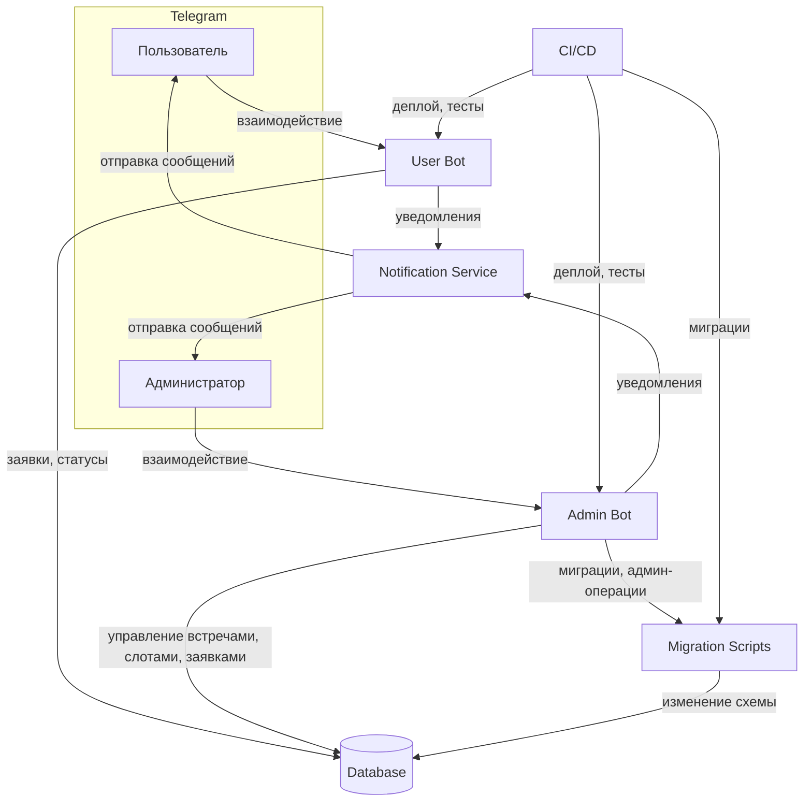
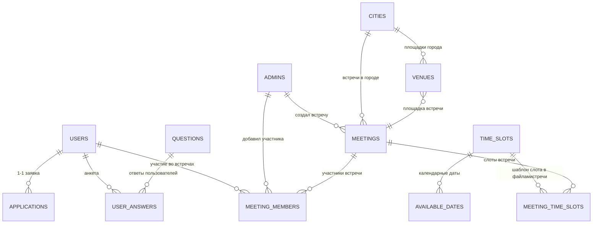
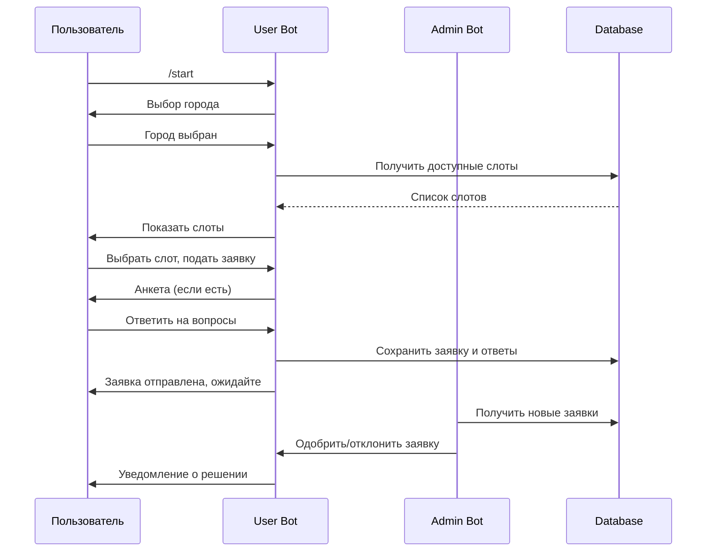
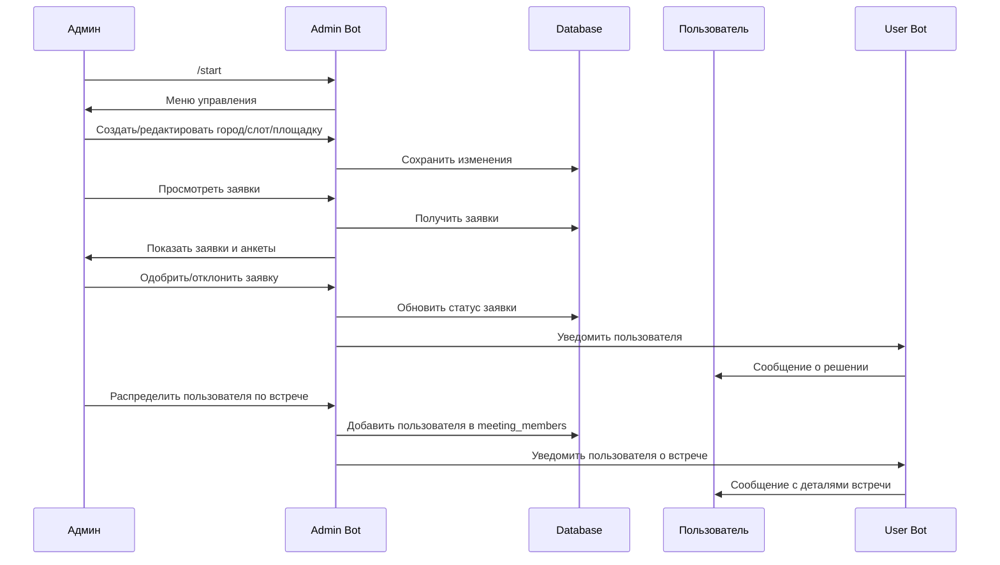

# Подробное описание сервиса "5 Chairs"

> **Внимание:** На текущем этапе проект находится в фазе активной доработки и стабилизации после масштабного рефакторинга. Главная цель — довести сервис до минимально жизнеспособного состояния (MVP), чтобы он запускался без ошибок и работал по основным сценариям (user/admin flow). Все рекомендации и документация ориентированы на ускорение запуска, устранение блокеров и помощь ИИ-ассистенту/разработчику. Не тратьте время на рефакторинг и улучшения, пока не работает MVP!

---

## Практические советы для запуска и отладки

- Проверьте, что все зависимости установлены:
  ```bash
  pip install -r requirements.txt
  ```
- Проверьте .env (минимум: DATABASE_URL, токены ботов)
- Примените миграции:
  ```bash
  alembic upgrade head
  ```
- Запустите сервисы:
  ```bash
  python run_user_bot.py
  python run_admin_bot.py
  python run_notification_service.py
  # (если есть) python run_timeslot_service.py
  ```
- Проверяйте логи на наличие ошибок запуска
- Основные сценарии тестируйте вручную: пользователь → заявка → админ → одобрение → распределение
- Все найденные баги и решения фиксируйте в отдельном файле или прямо в этом документе (см. шаблон в MVP ROADMAP & QUICK FIXES)
- Минимум документации — только то, что реально помогает запуску и отладке

---

## 1. Введение

"5 Chairs" — это сервис на базе Telegram-ботов для организации и управления офлайн-встречами с двухуровневой модерацией. Система предназначена для сообществ, клубов и групп, где требуется ручное одобрение участников и гибкое распределение по встречам.

**Ключевые особенности:**
- Два типа пользователей: обычные пользователи и администраторы.
- Пользователь может выбрать город и подать заявку на участие, выбрав из доступных временных слотов.
- Администратор одобряет заявки и вручную распределяет пользователей по встречам.
- Все встречи, временные слоты и площадки создаются и управляются только администратором.
- Система уведомлений информирует пользователей и админов о статусе заявок и встреч.
- Вся логика построена на современных сущностях: заявки (applications), встречи (meetings), временные слоты (time_slots), города (cities), площадки (venues).

Сервис ориентирован на сценарии, где важна ручная модерация, гибкое управление расписанием и прозрачность для всех участников процесса.

---

## 2. Архитектура и компоненты

### Общая схема (высокоуровневая)



### Описание основных компонентов

- **User Bot** (`run_user_bot.py`):
  - Принимает заявки от пользователей, показывает доступные города и временные слоты, информирует о статусе заявок и встреч.
  - Работает только с актуальными сущностями (applications, meetings, time_slots, cities, venues).

- **Admin Bot** (`run_admin_bot.py`):
  - Позволяет администратору создавать/редактировать встречи, временные слоты, площадки, одобрять заявки, распределять пользователей по встречам.
  - **При создании таймслота всегда требуется выбрать город (city_id).**
  - Управляет всей логикой модерации и расписания.

- **Database** (`database/`):
  - Хранит пользователей, заявки, встречи, временные слоты, города, площадки и связи между ними.
  - Вся бизнес-логика построена на новых таблицах (events/event_applications не используются).

- **Notification Service** (`run_notification_service.py`):
  - Отправляет уведомления пользователям и администраторам о статусах заявок, встреч, изменениях расписания.

- **Migration Scripts** (`migrations/`):
  - Используются для обновления схемы базы данных (Alembic).
  - После полной чистки содержат только актуальные миграции.

- **CI/CD**:
  - Автоматизация тестирования, деплоя, применения миграций.
  - Запуск ботов и сервисов в production/staging среде.

---

## 3. Роли и права

### Роли в системе

- **Пользователь**
  - Может выбрать город и подать заявку на участие во встрече, выбрав из доступных временных слотов.
  - Получает уведомления о статусе заявки и распределении по встрече.
  - Не может создавать, редактировать или удалять встречи, временные слоты, площадки.
  - Не видит других пользователей и не управляет расписанием.

- **Администратор**
  - Создаёт и редактирует встречи, временные слоты, площадки, города.
  - Просматривает и одобряет/отклоняет заявки пользователей.
  - Вручную распределяет одобренных пользователей по встречам.
  - Получает уведомления о новых заявках и изменениях статуса встреч.
  - Может удалять и изменять любые сущности (кроме пользователей, если не предусмотрено отдельно).

### Таблица прав и возможностей

| Действие                                      | Пользователь | Администратор |
|-----------------------------------------------|:------------:|:-------------:|
| Выбрать город                                 |      ✅      |      ✅      |
| Просмотреть доступные временные слоты         |      ✅      |      ✅      |
| Подать заявку на участие                      |      ✅      |      ❌      |
| Получать уведомления о статусе                |      ✅      |      ✅      |
| Создавать/редактировать встречи               |      ❌      |      ✅      |
| Создавать/редактировать временные слоты       |      ❌      |      ✅      |
| Создавать/редактировать площадки              |      ❌      |      ✅      |
| Одобрять/отклонять заявки                     |      ❌      |      ✅      |
| Распределять пользователей по встречам        |      ❌      |      ✅      |
| Удалять/изменять сущности (кроме пользователей)|      ❌      |      ✅      |
| Просматривать список заявок                   |      ❌      |      ✅      |
| Просматривать других пользователей            |      ❌      |      ✅      |

---

## 4. Структура базы данных

### ER-диаграмма (актуальная)



### Краткое описание таблиц

- **users** — пользователи системы (id, username, имя, фамилия, возраст, статус и др.)
- **admins** — администраторы (id, username, имя, superadmin, дата добавления)
- **applications** — заявки пользователей (id, user_id, time_slot_id, created_at)
- **cities** — города (id, name, active)
- **venues** — площадки (id, name, address, city_id, описание, active)
- **time_slots** — шаблоны временных слотов (id, day_of_week, start_time, end_time, city_id, active)
- **available_dates** — конкретные даты для слотов (id, date, time_slot_id, is_available)
- **meetings** — встречи (id, name, date, time, city_id, venue, status, created_by)
- **meeting_time_slots** — связь встреч и слотов (id, meeting_id, time_slot_id)
- **meeting_members** — участники встреч (id, meeting_id, user_id, added_by)
- **questions** — вопросы анкеты (id, text, active, display_order)
- **user_answers** — ответы пользователей на вопросы (id, user_id, question_id, answer)

### Ключевые связи
- Один пользователь — одна заявка
- Встреча связана с городом, площадкой, временным слотом (через meeting_time_slots)
- **Временной слот (time_slot) всегда принадлежит конкретному городу (city_id)**
- Пользователь может быть участником нескольких встреч (meeting_members)
- Временной слот может быть привязан к нескольким датам (available_dates)
- Вопросы и ответы — для анкетирования при подаче заявки

---

## 5. Сценарии работы с ботами

### User Flow (пользователь)

1. Пользователь запускает User Bot в Telegram.
2. Выбирает город из предложенного списка.
3. Получает список доступных временных слотов (созданы админом, **только для выбранного города**).
4. Выбирает слот и подаёт заявку на участие.
5. Заполняет анкету (если предусмотрено).
6. Получает уведомление о том, что заявка отправлена и ожидает одобрения.
7. После одобрения админом — получает уведомление о распределении по встрече (с датой, временем, местом).

#### Диаграмма последовательности (user flow)



---

### Admin Flow (администратор)

1. Админ запускает Admin Bot в Telegram.
2. Создаёт или редактирует города, временные слоты, площадки.
3. Создаёт встречи, назначает им слоты, площадки, дату.
4. Получает новые заявки пользователей.
5. Просматривает анкету пользователя, одобряет или отклоняет заявку.
6. Вручную распределяет одобренных пользователей по встречам.
7. Пользователь получает уведомление о распределении.

#### Диаграмма последовательности (admin flow)



---

## 6. Запуск и эксплуатация

### 6.1. Запуск вручную (через виртуальное окружение)

1. **Создать и активировать виртуальное окружение:**
   ```bash
   python3 -m venv venv
   source venv/bin/activate
   ```
2. **Установить зависимости:**
   ```bash
   pip install -r requirements.txt
   ```
3. **Настроить переменные окружения:**
   - Создать файл `.env` в корне проекта (см. пример в README или docker-compose.yml).
   - Указать параметры подключения к БД, токены ботов и другие секреты.
4. **Применить миграции Alembic:**
   ```bash
   alembic upgrade head
   ```
5. **Запустить нужный сервис:**
   - User Bot:
     ```bash
     python run_user_bot.py
     ```
   - Admin Bot:
     ```bash
     python run_admin_bot.py
     ```
   - Notification Service:
     ```bash
     python run_notification_service.py
     ```
   - Timeslot Service (если используется):
     ```bash
     python run_timeslot_service.py
     ```

### 6.2. Запуск через Docker/Docker Compose

1. **Создать файл `.env` в корне проекта** (см. пример переменных в docker-compose.yml).
2. **Собрать и запустить все сервисы:**
   ```bash
   docker-compose up --build
   ```
   - Это поднимет контейнеры для базы данных, всех ботов и сервисов.
   - Все зависимости и миграции будут установлены автоматически.
3. **Проверить логи:**
   ```bash
   docker-compose logs -f user_bot
   docker-compose logs -f admin_bot
   docker-compose logs -f notification_service
   ```

### 6.3. Важные нюансы
- Перед запуском вручную всегда активируйте виртуальное окружение: `source venv/bin/activate`
- Все секреты и параметры должны быть в `.env` (никогда не коммитьте его в git)
- Для работы с БД требуется PostgreSQL (можно использовать контейнер из docker-compose или локальный инстанс)
- Для применения миграций используйте Alembic (`alembic upgrade head`)
- Для CI/CD настройте автоматический запуск тестов, миграций и деплой (см. пример в docker-compose)
- Для production/staging рекомендуется использовать Docker Compose

---

## 7. Ключевые функции и точки входа

### 7.1. Основные точки входа

- **run_user_bot.py**
  - Точка входа для запуска пользовательского Telegram-бота.
  - Основные задачи:
    - Обработка команд и сообщений пользователей (старт, выбор города, просмотр слотов, подача заявки, анкета).
    - Взаимодействие с базой данных через актуальные сущности: `applications`, `meetings`, `time_slots`, `cities`, `venues`.
    - Отправка уведомлений пользователям о статусах заявок и встреч.
    - Вся логика построена на новых моделях, legacy-код полностью удалён.

- **run_admin_bot.py**
  - Точка входа для запуска административного Telegram-бота.
  - Основные задачи:
    - Создание и редактирование встреч, временных слотов, площадок, городов.
    - Просмотр и модерация заявок пользователей (одобрение/отклонение, просмотр анкет).
    - Ручное распределение пользователей по встречам.
    - Управление расписанием и модерацией.
    - Отправка уведомлений администраторам и пользователям.
    - Вся логика построена на новых моделях, legacy-код полностью удалён.

- **run_notification_service.py**
  - Сервис для асинхронной отправки уведомлений пользователям и администраторам.
  - Основные задачи:
    - Информирование о статусах заявок, встреч, изменениях расписания.
    - Использует шаблоны сообщений для разных статусов.
    - Может работать по событиям из базы или очереди.

- **run_timeslot_service.py** (если используется)
  - Сервис для автоматического управления доступностью временных слотов.
  - Основные задачи:
    - Генерация дат на основе шаблонов слотов.
    - Поддержка актуальности расписания без ручного вмешательства.

### 7.2. Ключевые функции и структура модулей

- **database/**
  - Модели SQLAlchemy для всех актуальных сущностей:
    - `User`, `Admin`, `Application`, `Meeting`, `TimeSlot`, `Venue`, `City`, `MeetingMember`, `MeetingTimeSlot`, `AvailableDate`, `Question`, `UserAnswer`.
    - **TimeSlot всегда содержит city_id (ForeignKey на cities.id).**
  - Все связи реализованы через ForeignKey и relationship.
  - Миграции Alembic поддерживают только актуальную схему (legacy-таблицы удалены).

- **user_bot/handlers/**
  - Модули для обработки команд пользователя:
    - `/start`, выбор города, просмотр слотов, подача заявки, анкета.
    - Вся логика построена на новых моделях (legacy-код удалён).
    - Используются состояния для пошагового диалога.

- **admin_bot/handlers/**
  - Модули для обработки команд администратора:
    - Создание/редактирование сущностей (города, площадки, слоты, встречи).
    - Просмотр и модерация заявок, распределение по встречам.
    - Вся логика построена на новых моделях.
    - Используются состояния для пошагового диалога и подтверждений.

- **notification_service/**
  - Логика асинхронной отправки уведомлений через Telegram API.
  - Поддержка шаблонов сообщений для разных статусов заявок и встреч.
  - Интеграция с базой данных для отслеживания событий.

- **migrations/**
  - Содержит только актуальные миграции Alembic.
  - После чистки — одна самостоятельная миграция (`down_revision = None`), полностью отражающая текущую структуру БД.

### 7.3. Взаимодействие между компонентами

- Все сервисы используют общую базу данных PostgreSQL.
- Взаимодействие между ботами и сервисами происходит через БД и (опционально) очереди/события.
- Уведомления отправляются асинхронно, чтобы не блокировать основной поток обработки команд.
- Все изменения статусов, распределение по встречам и модерация фиксируются в базе и отражаются в уведомлениях.

---

## 8. Схемы и диаграммы

В этом разделе собраны все ключевые схемы, иллюстрирующие архитектуру, бизнес-логику и взаимодействие компонентов сервиса "5 Chairs".

### 8.1. ER-диаграмма базы данных

- **Описание:**
  - ER-диаграмма отражает актуальную структуру базы данных, все основные сущности и связи между ними.
  - Позволяет быстро понять, как устроены отношения между пользователями, заявками, встречами, слотами, городами и площадками.
- **Схема:**
  - Диаграмма приведена в разделе 4 ("Структура базы данных").
  - Для актуализации используйте mermaid-синтаксис или инструменты визуализации по вашему выбору.

### 8.2. Диаграммы последовательности (User/Admin Flow)

- **User Flow:**
  - Показывает пошаговое взаимодействие пользователя с ботом: от старта до получения уведомления о встрече.
  - Включает все ключевые этапы: выбор города, подача заявки, анкета, ожидание одобрения, распределение по встрече.
  - Диаграмма приведена в разделе 5 ("User Flow").

- **Admin Flow:**
  - Иллюстрирует работу администратора: создание сущностей, модерация заявок, распределение пользователей.
  - Показывает, как админ взаимодействует с ботом, базой и пользователями.
  - Диаграмма приведена в разделе 5 ("Admin Flow").

### 8.3. Схема взаимодействия сервисов

- **Описание:**
  - Высокоуровневая схема, показывающая, как User Bot, Admin Bot, Notification Service, база данных и CI/CD взаимодействуют между собой.
  - Помогает понять архитектуру развертывания и обмена данными.
- **Схема:**
  - Приведена в разделе 2 ("Архитектура и компоненты").
  - Используйте mermaid или аналогичные инструменты для актуализации.

### 8.4. Рекомендации по созданию новых схем

- Для сложных изменений или новых сценариев рекомендуется добавлять отдельные схемы (например, для новых сервисов, очередей, интеграций).
- Используйте единый стиль оформления (mermaid, draw.io и др.) для всех диаграмм в проекте.
- Все схемы должны быть актуальны и соответствовать реальному состоянию кода и архитектуры.

---

## 9. Контакты/поддержка

<!-- (если нужно) -->
